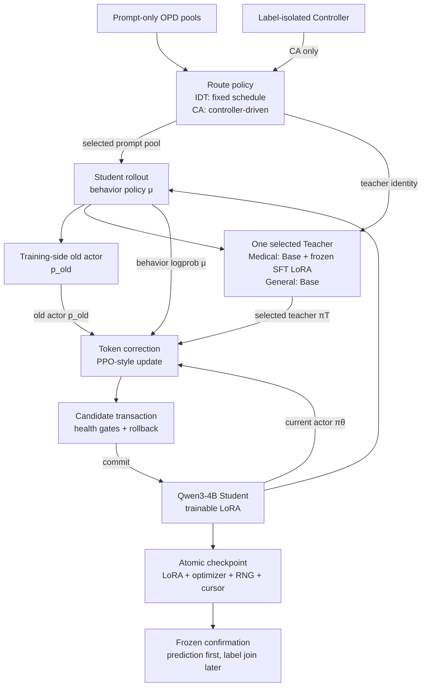

<div align="center">

# CA-OPD-MedicalGPT

<p><strong>在双 RTX 3090 上研究 Qwen3-4B 的医疗能力迁移与通用能力保持</strong></p>

[](#核心结论)
[](#研究问题与实验路线)
[](#系统实现与技术栈)
[](#复现)
[](LICENSE)

本仓库比较 Medical SFT、单教师 OPD、固定双教师 IDT 和约束感知 CA-OPD，
并用与 B2 训练和选模隔离的确认协议检验开发集结果。

[摘要](#摘要) · [结论](#核心结论) · [方法](#方法) · [系统](#系统实现与技术栈) ·
[数据](#数据与评测协议) · [结果](#实验结果) · [资源](#训练规模与资源开销) ·
[工程](#工程问题与实验复盘) · [复现](#复现) · [局限](#局限与伦理边界)

**Research only · Not for clinical use**

</div>

## 摘要

本项目研究冻结 Medical Teacher 的能力能否通过 on-policy distillation 迁移到从同一
Base checkpoint 初始化的 Qwen3-4B Student，同时将通用能力下降限制在 `1.00pp`
以内。训练端实现同轨迹教师打分、rollout correction、PPO-style 更新、事务式回滚和原子
checkpoint；评测端采用标签隔离和 prediction-first 协议。

结果并不支持所有初始假设。SFT-v3 在预冻结的 600 题开发确认协议上相对 Base 提升
`4.00pp`；B2 step240 在 300 题 Controller 上的 `+1.33pp` 趋势未能复现，在首次 B2
确认中 Base 与 B2 均为 `443/600`。相同 accepted-step 和 prompt 预算下，CA-OPD 也未优于
固定 IDT。确认后没有更换 checkpoint、seed、prompt template
或输出长度继续搜索正向结果，final test 始终未访问。

## 核心结论

| 研究假设 | 关键证据 | 判定 |
|---|---|---|
| SFT-v3 在冻结的 600 题开发确认协议上提高准确率 | `443 → 467`，`+4.00pp`，95% CI `[+1.17,+7.00]pp`，McNemar `p=0.0116` | 支持 |
| 本项目中的 SFT 会损害通用能力 | General Controller 点估计：`61.244% → 66.507%`；exact McNemar `p=0.0614` | 未观察到，但不宣称显著提升 |
| 单教师 Medical OPD 能稳定迁移医疗能力 | Controller 最佳点 `+1.33pp`；600 题 B2 确认 `0.00pp` | 不支持 |
| CA-OPD 优于固定 IDT | step120 Medical：`72.00% vs 72.33%` | 不支持 |
| CA 在通用约束下更稳定 | 单 seed、120 accepted steps 未形成优势 | 不支持 |

这里的“不支持”只针对本仓库冻结的模型、数据、`group_size=1`、训练预算与评测协议；它不等价于
证明 OPD 或自适应多教师方法普遍无效。

## 研究问题与实验路线

### 1. 约束目标

项目不只比较医疗准确率，而是把医疗增强写成带通用能力约束的优化问题：

```math
\max_\theta M_{\mathrm{medical}}(\theta),\qquad
M_{\mathrm{general}}(\theta)\ge M_{\mathrm{general}}(\theta_0)-\delta
```

其中 $\theta_0$ 为 Base Model，协议预先冻结 $\delta = 1.00\,\mathrm{pp}$。Teacher 路由、早停和
checkpoint 选择只能读取 Controller dev，不能读取 confirmation 或 final。

### 2. 对照路线

| ID | 初始化 | Teacher 策略 | 要回答的问题 |
|---|---|---|---|
| B0 | 原始 Qwen3-4B | 无 | 原始能力基线 |
| B1 | B0 + Medical SFT-v3 LoRA | 无 | 医疗监督微调能否形成合格 Teacher |
| B2 | B0 + 初始输出与 Base 等价的 LoRA | 仅 Medical Teacher | 单教师 OPD 能否迁移医疗能力 |
| IDT | B0 + 初始输出与 Base 等价的 LoRA | Medical / Base 固定交替 | 固定双教师路由能否兼顾两类能力 |
| CA-OPD | B0 + 初始输出与 Base 等价的 LoRA | Controller 驱动的 Medical / Base 路由 | 动态约束路由能否优于 IDT |

B2、IDT 和 CA-OPD 的 Student 均从同一 B0 checkpoint 初始化，B1 仅作为冻结 Teacher；因此这里研究的是
能力迁移，而不是在 SFT 权重上继续训练。Medical 路由每步使用 `2 Medical-O1 + 2 CMB` prompts
并由 Medical Teacher 评分；General 路由每步使用 `2 COIG-LeetCode + 2 GPT4-LLM` anchors 并由
Base Teacher 评分。LoRA-B 使用零初始化，因此 Student 在 step0 与 Base 等价。

### 3. 实验设置

| 设置 | 值 |
|---|---|
| Base | `Qwen/Qwen3-4B` |
| Model revision | [`1cfa9a7208912126459214e8b04321603b3df60c`](https://huggingface.co/Qwen/Qwen3-4B/commit/1cfa9a7208912126459214e8b04321603b3df60c) |
| Hardware | `2 × RTX 3090 24GB` |
| Main seed | `42` |
| OPD group size / response limit | `1 / 1024 tokens` |
| General constraint | 相对 Base 最多下降 `1.00pp` |
| 主实验 trainer | 仓库内实现的 `Transformers + PEFT` 三策略训练循环 |

### 4. 实现范围

| 层次 | 实现内容 | 证据入口 |
|---|---|---|
| 数据 | 来源与许可证绑定、统一 schema、流式构建、SQLite 索引、哈希去重、prompt-only OPD 导出、角色隔离 | [`src/data`](src/data) · [`docs/DATA_PROTOCOL.md`](docs/DATA_PROTOCOL.md) |
| SFT | Qwen3-4B BF16 + LoRA、按任务格式构造监督目标、双进程 memory-balanced DDP、独立 reload | [`src/sft`](src/sft) · [`configs/public/sft_v3.recorded.yaml`](configs/public/sft_v3.recorded.yaml) |
| OPD | 行为、旧策略、当前策略与教师概率分离，同轨迹 token scoring、rollout correction、PPO ratio/clip、prompt-equal reduction、三策略路由 | [`src/opd`](src/opd) · [`docs/METHOD.md`](docs/METHOD.md) |
| 可靠性 | 候选更新事务、完整回滚、原子 checkpoint、sampler identity、SHA-256 证据链 | [`docs/ENGINEERING_NOTES.md`](docs/ENGINEERING_NOTES.md) |
| 评测 | Transformers direct-logit scorer、prediction-first label join、paired bootstrap、exact McNemar | [`src/eval`](src/eval) · [`artifacts/results`](artifacts/results) |

上表描述实现范围；算法效果仍以后文的对照实验为准。

## 方法

### 1. 同轨迹 OPD 与四类概率

对 prompt $x$，rollout sampler 按 behavior policy $\mu$ 生成轨迹：

```math
y\sim\mu(\cdot\mid x)
```

主实验将四类概率分开记录：

| 符号 | 含义 | 梯度 |
|---|---|---|
| $\mu$ | rollout 时 sampler 对已选 token 的 behavior probability | stop-gradient |
| $p_{\mathrm{old}}$ | 更新前由训练侧标准 Transformers forward 重算的 old-actor probability | stop-gradient |
| $\pi_\theta$ | optimizer 侧当前 Student probability | 可求梯度 |
| $\pi_T$ | 选定 Teacher 对同一 token 序列的 probability | stop-gradient |

Teacher 不重新生成另一条 completion。Student 与 Teacher 对同一条 `prompt + student completion`
做 causal-shift 对齐和 token-level scoring；训练信号为：

```math
A_t=\beta\left[
\log\pi_T(y_t\mid x,y_{1:t-1})-
\log p_{\mathrm{old}}(y_t\mid x,y_{1:t-1})
\right]
```

```math
r_t(\theta)=\exp\left(
\log\pi_\theta(y_t\mid x,y_{1:t-1})-
\log p_{\mathrm{old}}(y_t\mid x,y_{1:t-1})
\right)
```

rollout backend 与训练侧标准 actor 的数值路径可能不同，因此另使用 detached token correction：

```math
c_t=\exp\left(
\mathrm{clip}\left[
\log p_{\mathrm{old}}(y_t)-\log\mu(y_t),\,-20,\,\log 2
\right]
\right)
```

统计意义上，$c_t$ 仅截断至最大值 `2`；公式中的 `-20` 只用于避免指数运算下溢，不是根据结果
设定的低概率裁剪阈值。最终 surrogate 将 $c_t$ 乘到 PPO clipped surrogate 上；
每条 trajectory 先对有效 completion token 取均值，再对 4 条 prompts 等权聚合。训练显式
检查 causal shift、padding、EOS、behavior support、old/current identity、ratio、ESS 与 sampler refresh。

### 2. Constraint-Aware Teacher Routing

CA-OPD 每 30 个 accepted steps 在标签隔离的 Controller 上更新 Medical / General 能力 EMA：

```math
\bar M_k=\rho\bar M_{k-1}+(1-\rho)M_k,\qquad
\bar G_k=\rho\bar G_{k-1}+(1-\rho)G_k
```

将两类能力与冻结目标之间的差值标准化后，计算下一窗口的 Medical Teacher 概率：

```math
g_M=\frac{T_M-\bar M_k}{s_M},\qquad
g_G=\frac{(B_G-\delta)-\bar G_k}{s_G}
```

```math
p_M=\mathrm{clip}\left(
\frac{e^{g_M/\tau}}{e^{g_M/\tau}+e^{g_G/\tau}},
p_{\min},p_{\max}
\right),\qquad p_G=1-p_M
```

主实验配置使用 `rho=0.7`、`tau=1.0`、`p_min=0.2`、`p_max=0.8`。迟滞状态用于避免在约束边界
频繁切换；进入 `RECOVER_GENERAL` 后直接令 $p_M=p_{\min}$，直到满足恢复条件。IDT 固定提交
`60 Medical / 60 General` 个路由步；CA-OPD 在同一 120-step 上限内
实际提交 `87 Medical / 33 General` 个路由步，说明路由策略确实不同，但结果没有显示 CA 优于 IDT。

### 3. KL 安全控制与事务式更新

系统按领域维护在 Student 轨迹已选 token 上估计的 reverse-KL EMA；只有当估计超出安全尺度时才
下调该领域更新，不放大梯度。每条 prompt 的梯度范数上限（trust budget）均为 `0.25`，
聚合后再执行全局梯度裁剪 `1.0`。

一次候选 optimizer update 只有在身份、有限值、ratio、ESS、梯度、生成质量和 checkpoint 门禁
全部通过并完整提交后，才计为一个 **accepted step**。失败候选会恢复 LoRA、optimizer、scheduler、
CPU/CUDA RNG、data cursor 与 sampler version；被拒绝的 attempt 不计入训练步数。

## 系统实现与技术栈



所有主结果均由仓库内实现的 `Transformers + PEFT` 三策略训练循环产生。veRL、vLLM 和 Ray
仅用于接口兼容、环境预检与 logprob 诊断，未作为主实验训练后端。

### 技术栈与职责

| 层次 | 技术 | 在本项目中的职责 | 证据状态 |
|---|---|---|---|
| 基础模型 | Qwen3-4B、BF16 | Base、Student 与同源 Medical/Base Teacher | 主实验 |
| 训练核心 | PyTorch 2.8.0、Transformers 4.56.2、PEFT 0.17.1、LoRA | forward/backward、adapter 路由、Student 更新与 checkpoint | 主实验 |
| 分布式 SFT | `torchrun`、DDP、CUDA/NCCL | 两卡本地 loss 与全局 denominator reduction，消除 DataParallel 主卡聚合峰值 | 主实验 |
| 可选 SFT 路径 | TRL 0.23.0 `SFTTrainer` | 提供兼容入口；SFT-v3 主结果不由该路径产生 | 非主结果路径 |
| OPD / PPO | 同轨迹 scoring、四类概率、rollout correction、ratio clip、prompt-equal objective | 实现 B2、IDT、CA 的统一三策略更新 | 主实验 |
| 兼容与诊断 | veRL 0.8.0、vLLM 0.11.0、Ray 2.48.0 | rollout-correction helper、接口适配、logprob 诊断与环境预检 | 非主结果后端 |
| 数据工程 | Hugging Face Datasets 3.6.0、SQLite、稳定 ID、SHA-256、near-duplicate group | 流式处理、来源追踪、跨角色去重和 manifest 冻结 | 主协议 |
| 评测统计 | Transformers direct logits、FP32 `log_softmax`、paired bootstrap、exact McNemar | 确定性选择题评分与配对不确定性分析 | 主评测 |
| 工程质量 | pytest、YAML/JSON 配置、safetensors、权限门禁 | 数学、token 对齐、泄漏、恢复、身份和 final 隔离检查 | 公开测试 + GPU 证据 |
| 硬件 | `2 × RTX 3090 24GB` | SFT/OPD 使用双卡；B2 确认在同一双卡主机上顺序使用 GPU0 | 实机运行 |

SFT 使用 FlashAttention 2；主实验 OPD 与 B2 确认评测使用 eager attention。环境版本与 CUDA
兼容关系见 [`env/README.md`](env/README.md) 和
[`env/requirements-opd.lock`](env/requirements-opd.lock)。

### 可靠性设计

- Base Student、Base Teacher、Medical Teacher 三种策略身份显式绑定；
- Qwen3-4B BF16 + LoRA rank `16` / alpha `32` / `all-linear` target；
- SFT 使用 memory-balanced DDP，OPD 使用 prompt microbatch `1`、gradient accumulation `4`；
- 主 MCQ 评测使用 Transformers direct logits，BF16 forward 后执行 FP32 `log_softmax`；
- 每个 accepted update 后刷新并验证 sampler identity，旧版本请求在 forward 前拒绝；
- 候选更新在 health gate 后整体 commit，否则完整 rollback；
- checkpoint 同时保存 LoRA、optimizer、scheduler、CPU/CUDA RNG、cursor 与 sampler state；
- model、data、config、checkpoint、prediction 与 result 通过 SHA-256 串成身份链；
- confirmation / final 使用独立权限门禁（capability gate），trainer 与 router 无法读取其标签。

## 数据与评测协议

公开数据只作为上游来源。仓库负责清洗、规范化、角色分配、去重、prompt-only 导出和 manifest，
但不重新分发模型权重、MedQA 原始题目或完整训练数据。MedQA 的许可证状态在本项目中记为
`unknown`，因此只用于本地评测，不随仓库重新分发。

| 数据角色 | 冻结规模 / 来源 | 用途与隔离 |
|---|---|---|
| Medical SFT-v3 | 9,600：7,200 CMB + 2,400 Medical-O1 中文 | CMB 为选项字母 + EOS，O1 为 Response + EOS；不训练 Complex-CoT |
| Medical OPD | 4,000：2,000 Medical-O1 holdout + 2,000 CMB train | prompt-only，物理删除监督字段 |
| General Anchors | 3,793：3,200 GPT4-LLM 中文 Alpaca + 593 COIG-LeetCode | prompt-only，只供 Base Teacher 路线；受各自非商用/相同方式共享条款约束 |
| Medical Controller | 300 题 | 开发集选模，label 仅 evaluator 可读 |
| General Controller | 209 题、8 个非医疗学科 | 通用约束与开发集分析 |
| Medical confirmation | 预冻结 MedQA validation 600 题 | 曾用于一次 B0/B1 Teacher 确认；隔离确认是首次 B2 访问 |
| Frozen final | Medical 600 + General 300 | 独立权限门禁，本项目从未授权或访问 |

训练、Controller、confirmation 与 final 使用稳定 `sample_id`、规范化文本哈希和近重复
`group_id` 做隔离。OPD 导出不含 `answer`、`answer_idx`、`label`、`reasoning`、`solution`、
`response`、`output`、`completion` 或可恢复监督答案的字段；B2 隔离确认审计中 confirmation 与所有
训练、OPD、General Anchor 和 Controller pool 的 sample/content/group overlap 均为 0。

选择题主指标采用实际 A–D / A–E 选项的 next-token direct logits。每条 route 的 prediction 先原子
写入并冻结 SHA，随后由独立 evaluator 打开物理分离的 label 文件；统计报告 paired bootstrap 95%
CI 与 two-sided exact McNemar 检验。final 不是普通的 `split=final` 参数，而是需要单独授权的
权限边界。

### 数据质量边界

自动去重共发现 433 个近重复候选，其中 23 个跨越数据角色，均按保守规则隔离。项目没有完成
逐条人工复核，因此只主张基于规则的隔离结果，不能表述为“经过全面人工审核”。机器可读报告保留
`formal_ready_mvp_waived` 和 `human_reviewed=false` 状态；这一限制适用于本文全部训练结果。

### Confirmation 与 final 的口径

内部阶段代号 P10 对应 B2 隔离确认。其 600 题在 B2 训练、路由和 checkpoint 选择期间不可见，
这是 B2 对该集合的首次访问；
但同一集合此前曾用于一次 B0/B1 Teacher 确认，所以它是 **与 B2 隔离的开发确认集**，不是全项目
从未访问过的 final test。final 的历史访问计数始终为 `0`。

## 实验结果

### 1. SFT-v3：预冻结 600 题确认

| Route | Correct | Accuracy | 相对 Base | Paired 95% CI | McNemar p |
|---|---:|---:|---:|---:|---:|
| B0 Base | 443/600 | 73.83% | — | — | — |
| B1 SFT-v3 step450 | 467/600 | 77.83% | +4.00pp | `[+1.17,+7.00]pp` | 0.0116 |

paired outcomes 为 `54 improved / 30 regressed / 516 unchanged`。SFT-v3 共训练 600 个 optimizer steps。
step450 与 step600 在 300 题 Medical Controller 上均为 `240/300`；预注册规则在并列时选择更早
checkpoint，因此 600 题确认评估的是 step450。该结果只支持冻结开发确认协议内的医疗准确率
提升，不能外推为 final-test、临床有效性或跨数据集泛化结论。

### 2. 同口径 Controller：B0 / B1 / B2 / IDT / CA

| Route | Medical 300 | General 209 | 相对 B0 Medical / General | 结论 |
|---|---:|---:|---:|---|
| B0 Base | 73.00% | 61.244% | — | Base |
| B1 SFT-v3 | 80.00% | 66.507% | +7.00 / +5.263pp | 两项点估计均提高 |
| B2 step120 | 72.33% | 61.244% | −0.67 / 0.00pp | Medical 未提升 |
| IDT step120 | 72.33% | 60.766% | −0.67 / −0.478pp | 满足点估计约束，但未提升 Medical |
| CA step120 | 72.00% | 60.287% | −1.00 / −0.957pp | 未优于 IDT |

B1 对 B0 的 General paired outcomes 为 `20 improved / 9 regressed / 180 unchanged`；paired
bootstrap 95% CI 为 `[+0.478,+10.526]pp`，但 exact McNemar `p=0.0614`。因此本文只说“没有
观察到遗忘且点估计提高”，不把它单独表述为统计显著的通用能力提升。

在 step120，CA 相对 IDT 的 Medical / General 差值为 `−0.33pp / −0.48pp`；两项置信区间均跨 0，
McNemar 检验均为 `p=1.0`。现有证据不支持 CA-OPD 优于 IDT。

### 3. B2 训练剂量曲线

| Accepted step | Medical correct / 300 | Medical | General correct / 209 | General |
|---:|---:|---:|---:|---:|
| 120 | 217 | 72.33% | 128 | 61.244% |
| 150 | 218 | 72.67% | 126 | 60.287% |
| 180 | 216 | 72.00% | 124 | 59.330% |
| 200 | 221 | 73.67% | 123 | 58.852% |
| **240** | **223** | **74.33%** | **126** | **60.287%** |
| 270 | 218 | 72.67% | 124 | 59.330% |
| 300 | 218 | 72.67% | 126 | 60.287% |

step240 是预注册规则选择的开发集最佳 checkpoint：相对 B0 增加 `4/300`，Medical 点估计
`+1.33pp`，paired CI `[-1.00,+4.00]pp`，exact McNemar `p=0.4240`。置信区间跨 0，且
step270 / step300 回落，因此该点只获得进入 B2 隔离确认的资格，不能直接作为算法提升结论。

### 4. B2 隔离确认（P10）

| Route | Correct | Accuracy |
|---|---:|---:|
| B0 Base | 443/600 | 73.8333% |
| B2 step240 | 443/600 | 73.8333% |
| Difference | 0 | 0.00pp |

- improved / regressed / unchanged：`10 / 10 / 580`；
- discordant pairs：`20`；
- paired bootstrap 95% CI：`[-1.50,+1.50]pp`，seed `42`，10,000 resamples；
- exact two-sided McNemar：`p=1.0`；
- B2 prediction 在确认前从未访问该集合；
- 两条 route 的 predictions 均在 label join 前冻结并生成 SHA；
- 同一集合此前用于一次 B0/B1 Teacher 确认，因此它不是未触碰的 final test；
- final access 始终为 `0`。

机器可读状态记录为 `b2_step240_confirmation_not_supported`。确认后没有更换 checkpoint、seed、
prompt 或输出长度，也没有放宽判定规则。

## 训练规模与资源开销

| Run | 训练进度 | 工作量 / route mix | 已计量时间 | 峰值显存 GPU0 / GPU1 |
|---|---:|---:|---:|---:|
| SFT-v3 | 600 optimizer steps | 9,600 examples | 约 30.4 min | 13.60 / 13.50 GiB（CUDA peak reserved） |
| IDT | 120 accepted / 2 rejected | Medical / General = 60 / 60 | 8.378 h（accepted steps 累计） | 15.89 / 16.13 GiB |
| CA-OPD | 120 accepted / 1 rejected | Medical / General = 87 / 33 | 6.190 h（accepted steps 累计） | 15.89 / 16.15 GiB |
| B2 剂量扩展（P9） | 180 accepted / 2 rejected | step120 → step300，Medical only | 计时器覆盖 4.495 h | 15.90 / 15.55 GiB |

IDT 与 CA 的“同预算”只表示两者均为 120 accepted steps、每步 4 prompts；它们的 route mix、
生成 token 数和实际 wall time 不相同。费用只根据实测进程时间和用户提供的历史估算费率
`2.96 CNY/instance-hour` 推导；平台完整实付账单不可读取时保持 `null`，不把估算写成实付。

## 工程问题与实验复盘

| 问题 | 观测与诊断 | 处理与边界 |
|---|---|---|
| DataParallel 在 GPU0 聚合 logits 时 OOM | 两卡总余量尚可，但主卡承担 full-vocabulary gather 峰值，step 1 前失败 | 改为双进程 memory-balanced DDP；每卡本地计算 loss，只同步全局 denominator，保持有效 batch 与损失定义 |
| SFT-v2 的监督权重与任务格式不匹配 | CMB 占 `15.79%` 样本，却只占 `0.861%` weighted denominator；1,500/1,500 条监督序列都从固定“答案：”前缀开始，0/1,500 的首个 supervised token 是 A–E | 将最后一次 repair 冻结为 7,200 CMB + 2,400 O1 按任务格式构造的 SFT-v3，不用结果后反复改配方 |
| vLLM LoRA `prompt_logprobs` 重复漂移 | Base 稳定，LoRA route 最大漂移 `0.114668`，超过冻结容差 `1e-4`；未证明具体底层原因 | 将主 MCQ 评分迁移到 Transformers direct logits；vLLM 保留为诊断路径，不宣称已定位上游 bug |
| rollout 与训练侧标准 actor 的概率混用 | 生成时 behavior $\mu$ 与 optimizer 侧 $p_{\mathrm{old}}$ 不是同一数值路径 | 分离四概率身份，引入 detached `p_old / μ` token correction，并验证 sampler tensor SHA |
| 真实 O1 批次在 `response limit=768` 时仍发生截断 | 长度门禁按预注册协议失败 | 只进行一次有证据的 768 → 1024 升级，没有循环搜索长度 |
| 单条 CMB trajectory 出现极端梯度 | 一条 raw prompt grad 达 `126.9449`；直接丢弃短答案会改变来源分布 | 四条 prompt 分别执行相同 `0.25` trust budget，再保留全局 clip；诊断候选全部 rollback |
| 配置 package 与 runtime schema 不一致 | 固定 token 的数学资格通过，但 canary 在模型加载前发现运行配置缺字段 | 不修改已冻结 artifact；新建版本，仅补 schema 后重新做资格验证 |
| 开发集最佳 checkpoint 未复现 | step240 在 300 题净增 4 题，600 题变为 10 改善 / 10 退化 | 接受隔离确认结果，不再追加 B2 训练，也未据此重跑 IDT/CA 或对 confirmation 调参 |

这些修复提高了训练过程和证据链的可信度，但不构成模型能力提升。

## 复现

### 1. 公开 CPU 验证

推荐 Python 3.12：

```bash
git clone https://github.com/Silkbamboo/CA-OPD-MedicalGPT.git
cd CA-OPD-MedicalGPT

python -m venv .venv
source .venv/bin/activate
python -m pip install -r requirements-dev.txt
bash scripts/run_public_checks.sh
```

只验证公开聚合结果，不安装训练依赖：

```bash
python scripts/verify_public_results.py
```

公开快照在隔离环境中实测 `313 passed, 1 skipped`。跳过的 1 项需要仓库未分发的真实 Qwen3
tokenizer；其余测试只使用合成 fixture，不下载模型或受限数据，也不访问 final。

### 2. 数据与 toy-OPD smoke

合成数据构建：

```bash
python -m src.data.build_splits \
  --config configs/data/fixture_cpu.yaml \
  --output-dir outputs/data/fixture-smoke
```

CPU toy-OPD 闭环：

```bash
python -m src.opd.loop_cli \
  --config configs/opd/dev_cpu.yaml \
  --output-dir outputs/opd-cpu-demo
```

该 toy loop 只验证 rollout、教师打分、路由、更新和 artifact 写入；脚本产生的 accuracy 不代表 Qwen3-4B
的能力。

### 3. GPU 协议重建边界

| 路径 | 内容 |
|---|---|
| [`env/requirements-opd.txt`](env/requirements-opd.txt) | 双 3090 实验记录的直接依赖版本 |
| [`env/requirements-opd.lock`](env/requirements-opd.lock) | 持久环境的 resolved lock |
| [`configs/public`](configs/public) | 脱敏后的 SFT、stage120、IDT/CA 与 P10 协议快照 |
| [`src/sft`](src/sft) | DDP SFT 与 LoRA artifact 逻辑 |
| [`src/opd`](src/opd) | 三策略 OPD、路由、事务更新与精确恢复 |
| [`src/eval`](src/eval) | direct-logit Controller 与 prediction-first confirmation |

模型、LoRA、原始数据、逐题 prediction 和 checkpoint 不进入 Git。公开配置中的路径已替换为
仓库内 `artifacts/...` 逻辑位置；复现实验者必须自行取得第三方资产、重建 manifest，并为新运行
生成新的 Git / config / data / checkpoint SHA 身份，不能冒用历史 artifact。完整说明见
[`docs/REPRODUCIBILITY.md`](docs/REPRODUCIBILITY.md)。

## 仓库导航

| 路径 | 内容 |
|---|---|
| [`docs/METHOD.md`](docs/METHOD.md) | 研究问题、训练数学与路由定义 |
| [`docs/DATA_PROTOCOL.md`](docs/DATA_PROTOCOL.md) | 数据角色、许可证与泄漏隔离 |
| [`docs/RESULTS.md`](docs/RESULTS.md) | 完整统计与可声明边界 |
| [`docs/ENGINEERING_NOTES.md`](docs/ENGINEERING_NOTES.md) | 关键故障、诊断和修复 |
| [`docs/REPRODUCIBILITY.md`](docs/REPRODUCIBILITY.md) | CPU 验证与 GPU 重建边界 |
| [`configs/public`](configs/public) | 公开的历史协议快照 |
| [`artifacts/results`](artifacts/results) | 无原题、无逐题预测的机器可读汇总 |

## 与相关工作的关系

本项目参考：

- [shibing624/MedicalGPT](https://github.com/shibing624/MedicalGPT) 的医疗后训练工程；
- [agentic-rl-lab / 02-opd](https://github.com/KMnO4-zx/agentic-rl-lab/tree/main/02-opd) 的
  Medical OPD、SAR 与固定 IDT 问题设置；
- [On-Policy Distillation of Language Models](https://arxiv.org/abs/2306.13649) 的学生自生成轨迹蒸馏范式；
- [veRL On-Policy Distillation](https://github.com/verl-project/verl/tree/main/examples/on_policy_distillation_trainer)
  的公开 OPD 接口与训练设计；
- [MOPD](https://arxiv.org/abs/2606.30406) 的多教师 on-policy distillation 研究。

本项目不复刻参考项目的绝对数值：模型 revision、训练后端、`group_size`、数据划分和评测协议
均不相同，因此结果不放在同一张主表中。多教师 OPD 也并非本项目首次提出。仓库实际增加的是
能力约束路由、双 3090 实现、事务式更新和独立确认协议，并如实保留未获支持的结果。

## 公开内容与资产边界

仓库公开：

- 核心源码、脱敏配置、公开测试与合成 fixtures；
- 生成和校验 manifest 的配置与代码；
- 方法、数据、结果、工程与复现说明；
- 不含原始题目和逐题预测的聚合统计。

仓库不公开：

- 模型权重、LoRA、optimizer state 与 checkpoint；
- MedQA 原始题目、受许可证限制的数据和逐题 label；
- 原始 rollout、prediction 与训练文本；
- API key、平台凭据和本机绝对路径；
- 面试题库、简历草稿、代理交接记录和内部调查全文。

## 局限与伦理边界

- 主实验只有一个随机种子；
- OPD 使用 `group_size=1`；
- IDT 与 CA-OPD 只完成 120 accepted steps；
- IDT 与 CA 只匹配 accepted-step 和 prompt 数，不匹配生成 token 数或 wall time；
- 主实验数据通过自动 schema、哈希、泄漏和跨角色近重复隔离，但人工逐条审计被显式豁免；
- Medical 与 General 主要是选择题能力，不代表临床诊断或医疗安全；
- B2 隔离确认没有支持相对 Base 的稳定提升，也没有证明等价性或非劣效性；
- 当前数据没有支持 CA-OPD 优于 IDT；
- final test 从未运行；
- 主实验 OPD 后端是仓库内实现的 Transformers/PEFT loop，而不是完整 veRL trainer；
- 结果不能外推到其他模型、数据、`group_size`、seed 或训练预算。

本项目仅用于算法研究和工程复现，不能用于临床诊断、处方或治疗决策。

## Citation

如需引用本仓库，请使用 [`CITATION.cff`](CITATION.cff) 中的元数据。

## License

代码按 [Apache-2.0](LICENSE) 发布。各数据集和基础模型继续遵循其各自许可证；本仓库不因代码
许可证而重新授权第三方数据或模型。
