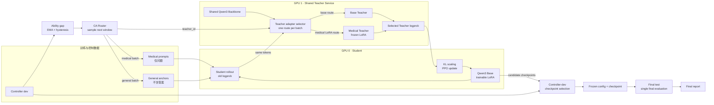

<div align="center">

# CA-OPD

### Constraint-Aware Multi-Teacher On-Policy Distillation

面向中文医疗能力增强与通用能力保持的约束感知双教师 On-Policy Distillation

[](#项目状态与结果)
[](#模型与算力)
[](#双-rtx-4090-系统设计)
[](#方法ca-opd)
[](#双-rtx-4090-系统设计)
[](LICENSE)

在双 RTX 4090 的资源约束下，研究医疗领域增强与通用能力遗忘之间的冲突；根据实时能力缺口动态路由 Medical/Base Teacher，并以领域级 KL 安全缩放稳定在线策略更新。

</div>

> **🚧 Active development.** CA-OPD 的方法定义、系统设计与评测口径已公开；Qwen3/veRL 实现、受控基线与正式实验仍在推进，本文不展示未经运行验证的结果数字。

## 30 秒了解项目

- **研究问题**：医疗 SFT 能增强领域能力，却可能造成通用能力遗忘；固定双 Teacher 比例又无法适应 Student 能力随训练变化的过程。
- **方法设计**：CA-OPD 依据 controller dev 上的医疗/通用能力缺口，动态选择 Medical Teacher 或 Base Teacher，并用 EMA、迟滞和概率边界抑制路由抖动。
- **稳定机制**：分领域跟踪 Student–Teacher KL，以安全缩放和 advantage clip 抑制极端更新与策略熵塌缩。
- **系统目标**：GPU 0 承担 Student 训练与 rollout，GPU 1 通过共享 Base Backbone 和冻结 Medical LoRA 提供双 Teacher scoring；目标栈为 veRL、vLLM、Ray 与 LoRA。
- **实验纪律**：controller dev 驱动调度和 checkpoint 选择；final test 只在配置与 checkpoint 固定后执行，不进入训练闭环。

```text
发现问题 → 建立同栈 baseline → 设计 CA-OPD → 实现双 4090 训练系统
        → 消融与多 seed 验证 → 分析能力 Pareto、稳定性与系统效率
```

## 研究问题

### 医疗增强是一个带约束的多目标问题

如果只追求医疗 benchmark，领域 SFT 可能在提高医疗准确率的同时损伤原始模型的通用能力。本项目将任务写成：

$$
\max_\theta M_{\mathrm{medical}}(\theta)
$$

$$
\text{s.t.}\quad M_{\mathrm{general}}(\theta)\ge M_{\mathrm{general}}(\theta_0)-\delta
$$

其中 $\theta_0$ 是 Base Model，$\delta$ 是在查看 final test 前确定的通用能力下降阈值。Teacher 调度、超参数筛选、早停和 checkpoint 选择只能读取 controller dev。

项目真正关心的不是“谁的医疗分数最高”，而是：

> 在预先确定的通用能力约束下，哪个方法能获得更高、更稳定的医疗能力，并以合理的训练与系统成本进入可行区域？

### 为什么选择 On-Policy Distillation

SFT 在固定 Teacher 答案上学习；OPD 则让当前 Student 先生成轨迹，再由 Teacher 对**完全相同的 token 序列**计算 logprob。训练信号直接作用于 Student 实际访问的状态分布，可用于研究离线答案与 Student rollout 之间的分布偏移。

这条链路必须验证：

- Teacher 不重新生成另一条 completion；
- Student/Teacher 在相同 token 和自回归上下文上比较；
- prompt、padding、EOS 与 completion mask 正确；
- rollout old logprob 在一次更新内冻结；
- sampler 在策略更新后正确刷新。

这些条件需要单元测试和最小可解释案例证明，训练 loss 下降不能替代正确性验证。

## 为什么现有方案还不够

| 方法 | 训练信号 | 作用 | 局限 |
|---|---|---|---|
| Medical SFT | 固定医疗答案的 token CE | 注入领域知识和回答模式 | 可能造成通用能力遗忘与 exposure bias |
| Medical OPD | Medical Teacher 对 Student 轨迹的 logprob | 在 Student 自身分布上学习 | 单 Teacher 仍可能持续偏离通用 Base |
| SAR-OPD | 先 Medical Teacher，再 Base Teacher | 顺序恢复通用能力 | 阶段切换与恢复强度依赖人工设定 |
| IDT-OPD | Medical/Base Teacher 固定比例交替 | 同时接收两类信号 | 固定比例无法适应动态能力缺口 |
| **CA-OPD** | 能力缺口驱动的 Teacher 路由 | 显式优化能力约束 | 收益仍需同栈 baseline 与消融验证 |

固定 1:1 不等于两个 Teacher 产生相同优化强度。Teacher–Student KL、序列长度、有效 token 数与 Student 当前能力都会改变实际梯度贡献，因此本项目不把 step 比例直接等同于能力优化比例。

## 相较已有项目，本项目做什么

这里有两层来源：

1. 上游 [shibing624/MedicalGPT](https://github.com/shibing624/MedicalGPT) 提供通用医疗后训练基础；
2. [llm-agent-rl-lab / 02-opd](https://github.com/KMnO4-zx/llm-agent-rl-lab/tree/main/02-opd) 提供 Medical OPD、SAR 与固定 IDT 的主要参考。

| 维度 | 上游 MedicalGPT | 参考 02-opd | 本仓库新增设计（待实现/验证） |
|---|---|---|---|
| 定位 | 医疗 PT/SFT/RLHF/DPO/GRPO/单 Teacher OPD 工具链 | 医疗 OPD、SAR、固定双 Teacher 复现 | 医疗增强下的通用能力约束优化 |
| 正式栈 | Transformers/TRL 等训练脚本 | PyTRIO 远程服务 | veRL + vLLM + Ray 本地闭环 |
| Teacher 策略 | 多 Teacher 不是核心问题 | 顺序或固定比例 | 能力缺口驱动的动态路由 |
| 稳定控制 | 通用训练稳定策略 | 固定 KL/训练配置 | 领域级 KL EMA、安全缩放与裁剪 |
| 系统拓扑 | 通用单/多卡训练 | 底层资源由服务封装 | 双 4090 角色分离、共享 Backbone 双 Teacher |
| 评测重点 | 训练、推理和示例 | 医疗/通用选择题 | 约束满足率、Pareto、稳定性、系统效率与消融 |
| 数据纪律 | 面向通用训练场景 | 参考实验口径 | ID/文本哈希去重，controller dev 与 final test 隔离 |

本项目计划验证四项改进：

1. **约束感知 Teacher 路由**：根据两项能力的标准化缺口更新 $p_M$ 和 $p_G$；
2. **领域级 KL 安全缩放**：某一领域突然偏离 Teacher 时，主动降低该领域更新尺度；
3. **共享 Backbone 双 Teacher**：Base Teacher 使用原始 Backbone，Medical Teacher 使用同一 Backbone 加冻结 Medical LoRA；
4. **无测试集泄漏的约束评测**：controller dev 负责调度和 checkpoint 选择，final test 仅做最终一次性评测。

> [!NOTE]
> 多教师 OPD 已有 MOPD 等公开研究。本项目不宣称首次提出多教师蒸馏；项目级差异在于能力保持约束、动态路由、领域 KL 控制、双 4090 目标实现与受控消融。

## 方法：CA-OPD

### 1. 同轨迹 token-level OPD

Student 生成轨迹：

$$
y\sim\pi_\theta(\cdot\mid x)
$$

Teacher 和 Student 在同一条 `prompt + student completion` 上比较：

$$
r_t^{\mathrm{KL}}=\log\pi_\theta(y_t\mid x,y_{<t})-\log\pi_T(y_t\mid x,y_{<t})
$$

$$
A_t=\beta[\log\pi_T(y_t\mid x,y_{<t})-\log\pi_\theta(y_t\mid x,y_{<t})]
$$

随后使用 PPO clipping 或等价 importance-ratio policy gradient 更新 Student；Teacher 只执行 forward/prefill，不参与反向传播。

### 2. 约束感知 Teacher 路由

每隔 $K$ 个 optimizer step，在 controller dev 上计算医疗和通用能力 EMA：

$$
\bar M_k=\rho\bar M_{k-1}+(1-\rho)M_k,\qquad
\bar G_k=\rho\bar G_{k-1}+(1-\rho)G_k
$$

标准化能力缺口：

$$
g_M=\frac{T_M-\bar M_k}{s_M},\qquad
g_G=\frac{(B_G-\delta)-\bar G_k}{s_G}
$$

下一训练窗口的 Teacher 概率：

$$
p_M=\operatorname{clip}\left(
\frac{e^{g_M/\tau}}{e^{g_M/\tau}+e^{g_G/\tau}},
p_{\min},p_{\max}\right),\qquad p_G=1-p_M
$$

其中 $T_M$ 是预先设定的医疗目标，$B_G$ 是 Base Model 在 controller dev 上的通用基准，$s_M$ 与 $s_G$ 是两类指标的归一化尺度；这些量在启用调度前由实验协议或 controller dev 固定，final test 不参与估计。

- **EMA** 降低单次评测噪声；
- **迟滞状态** 防止在约束边界频繁切换；
- **概率边界** 防止任一 Teacher 长期饿死；
- **受控停止** 只依据 controller dev，绝不读取 final test。

### 3. 领域级 KL 安全缩放

$$
s_d=\min\left(1,\frac{\kappa_d}{\operatorname{EMA}(D_{\mathrm{KL},d})+\epsilon}\right)
$$

$$
A_t^{(d)}=\operatorname{clip}\left(
s_d[\log p_{T_d}(y_t)-\log p_S(y_t)],-A_{\max},A_{\max}\right)
$$

该机制形成一个待检验假设：当某一领域 KL 异常增大时，缩小该领域更新能否减少极端 advantage、clip fraction 和策略熵快速下降？它不预先保证性能提升。

## 双 RTX 4090 系统设计



图中 final test 只接收由 controller dev 选定并冻结的配置与 checkpoint，且没有任何反向边进入 Controller、Router 或训练过程。

| 资源 | 角色 | 关键约束 |
|---|---|---|
| GPU 0 | Qwen3 Student、LoRA 训练、rollout | 训练与生成分时复用显存，更新后刷新 sampler |
| GPU 1 | Base/Medical Teacher scoring | 共享 Base 权重，只交换 token、logprob 和必要元数据 |
| CPU/Ray | 数据、调度与任务编排 | 减少 4090 无 NVLink 下的高频参数通信 |

目标软件栈：

| 环节 | 计划采用 |
|---|---|
| SFT | Transformers + TRL `SFTTrainer` + PEFT LoRA |
| OPD | veRL OPD / PG-OPD |
| Rollout / Teacher | vLLM generate 与 prefill/logprob 服务 |
| 多 Teacher | vLLM multi-LoRA 或自定义 adapter router |
| 编排 / 配置 / 测试 | Ray · YAML/Hydra · pytest |

## 实验协议

本节定义公开实验口径。

### 模型与算力

| 层级 | 模型/平台 | 用途 |
|---|---|---|
| 开发 | `Qwen3-1.7B` | 数学正确性、20–50 step 冒烟、超参筛选、完整消融与多 seed |
| 主结果 | `Qwen3-4B` | 在冻结配置上运行关键 baseline 与 CA-OPD |
| 正式平台 | AutoDL `2 × RTX 4090 24GB` | 所有主结果使用同一主要软件栈和评测口径 |

正式训练仅在配置、数据、测试、CPU dry-run 和单 GPU 短跑通过后启动，并设置明确的资源与费用上限。

### 数据边界

| 数据角色 | 训练可见字段 | 可驱动路由/选 checkpoint | 进入 final test |
|---|---|:---:|:---:|
| Medical SFT | question + answer/reasoning | 否 | 否 |
| Medical OPD prompts | 仅问题 | 否 | 否 |
| General anchors | 题目与选项，不含答案 | 否 | 否 |
| Controller dev | 确定性开发评测 | 是 | 否 |
| Final test | 仅最终评测 | **禁止** | 是 |

样本必须保留稳定 `sample_id`、来源、split、domain 和规范化文本哈希；SFT、OPD、controller dev 与 final test 互斥，并保存版本化 manifest。

### Baseline 与消融

| ID | 方法 | 对照目的 |
|---|---|---|
| B0 | Base | 原始能力基线 |
| B1 | Medical SFT | 医疗增益是否伴随通用遗忘 |
| B2 | Medical OPD | 单 Teacher OPD 是否有效 |
| B3 | SAR-OPD | 顺序恢复能否保持两项能力 |
| B4 | IDT 1:1 | 固定双 Teacher 基线 |
| B5 | IDT 2:1 | 排除“只是比例没调好” |
| O1 | CA-OPD | 动态约束方法 |

关键消融包括：固定 `1:1` vs `2:1`、去动态路由、去 KL 缩放、不同 controller 窗口 $K$、不同约束 $\delta$、group size `2` vs `4`。1.7B 执行完整消融与多 seed，4B 只验证最重要结论。

### 指标

| 维度 | 核心指标 |
|---|---|
| 能力 | Medical/General accuracy、$\Delta M$、$\Delta G$、是否满足 $\Delta G\ge-\delta$ |
| 稳定性 | 分领域 reverse KL、entropy、advantage/clip fraction、最佳与最终 checkpoint 差距 |
| 多目标 | Pareto frontier、约束内最佳医疗分数、time-to-feasible |
| 系统 | 峰值显存、rollout/Teacher tokens/s、step time、同步开销、GPU-hour 与费用 |

## 项目状态与结果

| 模块 | 公开状态 | 对应交付 |
|---|---|---|
| 研究问题与 CA-OPD 方法定义 | 设计完成 | 目标函数、路由公式与 KL 安全控制 |
| 双 RTX 4090 系统方案 | 设计完成（含可行性核实） | GPU 角色拆分、共享 Teacher 拓扑、[ADR-0002](docs/decisions/0002-dual-teacher-topology.md) |
| 技术栈与模型版本 | 已锁定 | [ADR-0001](docs/decisions/0001-opd-stack-and-models.md)：Qwen3-1.7B/4B、veRL PG-OPD、vLLM、CUDA/transformers 版本矩阵 |
| OPD 数学正确性（对齐/mask/advantage/PPO/KL 缩放） | ✅ CPU 已验证 | `src/opd/core.py` + 29 项单测 |
| CA-OPD 路由与迟滞状态机 | ✅ CPU 已验证 | `src/opd/router.py` + 25 项单测 |
| 端到端训练闭环与精确 resume | ✅ CPU 已验证 | `src/opd/loop.py` + 19 项集成测试 |
| 数据 schema、四路 split 隔离、final-test 审计 | ✅ CPU 已验证 | `src/data/` + 44 项单测、版本化 manifest |
| MCQ 评测与行为诊断评测 | ✅ CPU 已验证 | `src/eval/` + 58 项单测 |
| 付费训练门禁（run 计划/成本上限/泄漏检查） | ✅ CPU 已验证 | `scripts/preflight.py` + 25 项单测 |
| Medical SFT / OPD / SAR / IDT | 未发布结果 | 同栈配置、日志与 checkpoint |
| CA-OPD 消融与多 seed | 未发布结果 | 原始指标与统计汇总 |
| Qwen3-4B 主实验与 final test | 尚未执行 | 冻结配置结果与最终报告 |

Phase 0（正确性）已完成：**200 项测试在 CPU 上通过**（`bash scripts/run_cpu_checks.sh`，分组独立进程执行），
覆盖 token 对齐、prompt/padding/EOS mask、advantage 方向、old logprob 冻结、PPO clip 边界、
领域级 KL 安全缩放、reduction 长度偏置、路由 EMA/迟滞/概率边界/早停、split 互斥与哈希去重、
OPD 池不落盘答案、final-test 访问审计、checkpoint 恢复后指标逐位一致。
过程记录见 [Phase 0 工作日志](docs/experiments/phase0_worklog.md)。

当前公开版本聚焦 CA-OPD 方法、系统设计与实验口径。受控基线与完整结果将在 GPU 阶段按里程碑发布。前期 Qwen2.5-1.5B 医疗 SFT、DPO、GRPO 与规则评测作为前置探索资产保留在 [`legacy/`](legacy/README.md)，不属于 Qwen3 + veRL/vLLM OPD 主线，也不会进入 CA-OPD 主结果表。

当前没有可用于 CA-OPD 主结论的正式结果。未来主表固定报告 Medical、General、$\Delta M$、$\Delta G$、约束是否满足和 seed 数；每行链接 YAML、git SHA、数据 manifest、metadata、原始 metrics、checkpoint 选择依据与失败记录。图表由原始产物自动生成，不手工填写。

## 复现门槛与路线图

新 OPD 主线尚未达到可复现发布门槛，因此当前不提供无法执行的 Quick Start。发布运行入口前必须完成：

1. 配置 schema 与数据 manifest 检查；
2. split 互斥、文本哈希去重和 final-test 隔离测试；
3. OPD 数学、路由与 checkpoint/sampler 同步测试；
4. CPU/小模型单步 dry-run 与单 GPU 短跑；
5. 环境、seed、run metadata、资源与费用上限记录。

路线图：

- **Phase 0 · 正确性**：数据、token alignment、mask、advantage、PPO ratio、checkpoint 与 dry-run；
- **Phase 1 · 1.7B baseline**：Base、Medical SFT、Medical OPD、SAR、IDT；
- **Phase 2 · 1.7B 改进**：CA-OPD、关键消融、多 seed，并冻结 4B 配置；
- **Phase 3 · 4B 主实验**：统一正式栈运行关键 baseline 与 O1，随后执行 final test；
- **Phase 4 · 分析交付**：Pareto、稳定性、案例、显存/吞吐、复现文档与简历描述。

只有在端到端 OPD、同栈 baseline、CA-OPD 消融、数据隔离、结果图表和复现入口全部具备后，项目才标记为完成。

## 局限与责任边界

- CA-OPD 当前是待实现、待验证的项目级改进，不代表已经优于 IDT、SAR 或单 Teacher OPD；
- 多教师 OPD 并非本项目首次提出，相关工作包括 MOPD；
- 双 RTX 4090 的系统结论不能直接外推到多机集群；
- 选择题和行为诊断集不能证明临床安全、诊断或治疗能力；
- 本项目不构成医疗建议，不用于临床诊断、治疗决策或患者分诊；
- 模型、数据和第三方组件仍受各自许可证与使用条款约束。

## 参考与致谢

- [shibing624/MedicalGPT](https://github.com/shibing624/MedicalGPT)：本仓库继承的医疗大模型训练基础；
- [llm-agent-rl-lab / 02-opd](https://github.com/KMnO4-zx/llm-agent-rl-lab/tree/main/02-opd)：Medical OPD、SAR 与固定 IDT 的主要参考；
- [veRL: On-Policy Distillation](https://verl.readthedocs.io/en/latest/algo/opd.html)；
- [veRL: RL(HF) with LoRA](https://verl.readthedocs.io/en/latest/advance/ppo_lora.html)；
- [vLLM: LoRA Adapters](https://docs.vllm.ai/en/latest/features/lora/)；
- [TRL: SFT Trainer](https://huggingface.co/docs/trl/sft_trainer)；
- [Qwen3-4B Model Card](https://huggingface.co/Qwen/Qwen3-4B)；
- [MiniLLM](https://arxiv.org/abs/2306.08543) 与 [On-Policy Distillation of Language Models](https://arxiv.org/abs/2306.13649)；
- [MOPD: Multi-Teacher On-Policy Distillation](https://arxiv.org/abs/2606.30406)。

感谢上述项目与研究提供的方法和工程基础。本项目只使用“设计、实现、验证、改进”等措辞，不把已有思想重新包装为首次提出。

## License & Disclaimer

代码继承并遵循 [Apache License 2.0](LICENSE)；模型权重、数据和第三方组件需同时遵循各自许可证。

本仓库仅用于大语言模型研究，不承担因使用代码、数据或模型造成的直接或间接损失。医疗输出不得替代执业医生判断；如涉及真实健康问题，请咨询具备资质的医疗专业人员。
