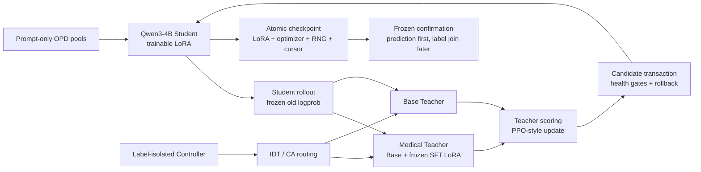

<div align="center">

# CA-OPD-MedicalGPT

### Qwen3-4B 医疗能力迁移与通用能力保持的受控实验

[](#实验结论)
[](#实验结论)
[](#模型与方法)
[](#系统实现)
[](#复现)
[](LICENSE)

在 `2 × RTX 3090 24GB` 上实现医疗 SFT、单教师 Medical OPD、固定双教师 IDT 与约束感知 CA-OPD，
并用预注册、prediction-first 的独立确认实验检验医疗能力迁移是否可复现。

**Research only · Not for clinical use**

</div>

> 本项目保留并公开负向结果：SFT-v3 的医疗增益获得独立确认；Medical OPD 在开发集最佳
> checkpoint 上出现 `+1.33pp` 点估计，但没有在独立 600 题确认中复现；固定 IDT 与
> CA-OPD 的等预算实验也没有支持 CA 优于 IDT。项目没有继续针对确认集调参，也没有访问
> final test。

## TL;DR

- **做了什么**：围绕 Qwen3-4B 构建 Medical SFT → Medical OPD → IDT → CA-OPD 的训练与评测闭环。
- **得到什么**：SFT-v3 在冻结的 600 题确认集上相对 Base 提升 `4.00pp`；B2 step240 的开发集趋势在另一轮独立 B2 确认中变为 `0.00pp`。
- **项目价值**：实现双 3090 下的三策略训练、原子 checkpoint、完整恢复、候选更新事务回滚、标签隔离评测和配对统计，而不是只报告最好的开发集数字。

| 冻结事实 | 值 |
|---|---|
| Base | `Qwen/Qwen3-4B` |
| Model revision | `1cfa9a7208912126459214e8b04321603b3df60c` |
| Hardware | `2 × RTX 3090 24GB` |
| Main seed | `42` |
| OPD group size / response limit | `1 / 1024 tokens` |
| Formal trainer | custom `Transformers + PEFT` three-policy loop |
| Final-test access | `0` |

## 实验结论

| 研究假设 | 关键证据 | 判定 |
|---|---|---|
| Medical SFT 能提升医疗能力 | 600 题：`443 → 467`，`+4.00pp`，95% CI `[+1.17,+7.00]pp`，McNemar `p=0.0116` | 支持 |
| 本项目中的 SFT 会损害通用能力 | Controller：`61.244% → 66.507%` | 未观察到 |
| 单教师 Medical OPD 能稳定迁移医疗能力 | 开发集最佳点 `+1.33pp`；600 题 B2 确认 `0.00pp` | 不支持 |
| CA-OPD 优于固定 IDT | step120 Medical：`72.00% vs 72.33%` | 不支持 |
| CA 在通用约束下更稳定 | 当前单 seed、120 步证据未形成优势 | 不支持 |

这里的“不支持”不等于证明所有 OPD 或 CA 方法无效。它只表示：在本仓库冻结的模型、数据、
`group_size=1`、训练预算和评测协议下，没有观察到可复现的正向结果。

## 模型与方法

| ID | 路线 | 定义 |
|---|---|---|
| B0 | Base | 原始 Qwen3-4B |
| B1 | Medical SFT-v3 | Base + 医疗监督微调 LoRA，作为冻结 Medical Teacher |
| B2 | Medical OPD | fresh Base Student 在自身 rollout 上接受 Medical Teacher 评分 |
| IDT | Fixed Interleaved Distillation | Medical/Base Teacher 以冻结比例交替 |
| CA-OPD | Constraint-Aware OPD | 根据 Medical/General 能力缺口动态路由 Teacher |

Student 首先生成轨迹：

$$
y\sim\pi_\theta(\cdot\mid x)
$$

Teacher 与 Student 在同一条 `prompt + student completion` 上计算目标 token 概率：

$$
A_t=\beta\left[\log\pi_T(y_t\mid x,y_{<t})-\log\pi_\theta(y_t\mid x,y_{<t})\right]
$$

训练使用冻结的 rollout old logprob、PPO ratio/clip 和 LoRA 更新。Teacher 不重新生成另一条
completion，也不接收反向传播。

CA-OPD 把问题写为：

$$
\max_\theta M_{\mathrm{medical}}(\theta),\qquad
M_{\mathrm{general}}(\theta)\ge M_{\mathrm{general}}(\theta_0)-\delta
$$

它根据 Controller 上的能力缺口和迟滞状态调整 Medical/Base Teacher 路由。该机制是本项目
设计并评估的研究假设，不是已经验证有效的算法结论。

## 系统实现



最终正式训练后端是项目自研的 `Transformers + PEFT` 三策略 production loop。veRL/vLLM
配置、适配器和预检被保留用于兼容与诊断，但本项目不把主实验描述为“完整 veRL trainer 结果”。

关键实现包括：

- Qwen3-4B BF16 + LoRA；
- SFT 的 memory-balanced DDP；
- Base Student、Base Teacher、Medical Teacher 三种策略身份绑定；
- Transformers direct-logit MCQ scorer；
- prompt-equal objective 与每条 trajectory 独立 trust budget；
- 候选更新的完整事务回滚；
- LoRA、optimizer、scheduler、CPU/CUDA RNG、cursor、sampler version 的原子恢复；
- 配置、数据、模型、checkpoint 与结果的 SHA-256 身份链；
- confirmation/final 独立 capability，训练器与路由器无法读取其标签。

## 数据协议

公开数据只作为原始来源，仓库不重新分发模型权重、MedQA 原始题目或完整训练数据。

| 数据角色 | 来源 | 用途与隔离 |
|---|---|---|
| Medical SFT | Medical-O1 中文 + CMB train bridge | 仅 SFT 可读取答案/推理 |
| Medical OPD | Medical-O1 holdout + CMB train | 导出为 prompt-only，物理删除监督字段 |
| General Anchors | 许可合格的非医疗指令/考试子源 | prompt-only，只供 Base Teacher 路线 |
| Medical Controller | 300 题 | 开发集选模，label 仅 evaluator 可读 |
| General Controller | 209 题、8 个非医疗学科 | 约束与开发集分析 |
| Medical confirmation | 预冻结 MedQA validation 600 题 | checkpoint 冻结后一次性 B2 确认 |
| Final | 独立 capability | 本项目从未访问 |

训练、Controller、confirmation 与 final 使用稳定 ID、规范化文本哈希和近重复 group 做隔离；
P10 审计中 confirmation 与所有训练/Controller pool 的 sample/content/group overlap 均为 0。

## 主结果

### 1. SFT-v3 独立确认

| Route | Correct | Accuracy | 相对 Base | Paired 95% CI | McNemar p |
|---|---:|---:|---:|---:|---:|
| B0 Base | 443/600 | 73.83% | — | — | — |
| B1 SFT-v3 | 467/600 | 77.83% | +4.00pp | `[+1.17,+7.00]pp` | 0.0116 |

这是冻结的 development confirmation，不是 final test。当前实验没有观察到最初假设的 SFT
通用能力遗忘：在同口径 General Controller 上，B1 也高于 B0。

### 2. 同口径 Controller

| Route | Medical 300 | General 209 | 相对 B0 Medical / General | 结论 |
|---|---:|---:|---:|---|
| B0 Base | 73.00% | 61.244% | — | Base |
| B1 SFT-v3 | 80.00% | 66.507% | +7.00 / +5.263pp | 两项均提升 |
| B2 step120 | 72.33% | 61.244% | −0.67 / 0.00pp | Medical 未提升 |
| IDT step120 | 72.33% | 60.766% | −0.67 / −0.478pp | 满足点估计约束，但未提升 Medical |
| CA step120 | 72.00% | 60.287% | −1.00 / −0.957pp | 未优于 IDT |

### 3. B2 训练剂量曲线

| Accepted step | Medical | General |
|---:|---:|---:|
| 120 | 72.33% | 61.244% |
| 150 | 72.67% | 60.287% |
| 180 | 72.00% | 59.330% |
| 200 | 73.67% | 58.852% |
| **240** | **74.33%** | **60.287%** |
| 270 | 72.67% | 59.330% |
| 300 | 72.67% | 60.287% |

step240 是预注册规则选择的开发集最佳 checkpoint：相对 B0 净增加 4/300，Medical 点估计
`+1.33pp`；但 paired CI 跨 0，且 step270/300 回落，因此只能进入独立确认，不能直接当作
算法提升结论。

### 4. P10：600 题一次性 B2 确认

| Route | Correct | Accuracy |
|---|---:|---:|
| B0 Base | 443/600 | 73.8333% |
| B2 step240 | 443/600 | 73.8333% |
| Difference | 0 | 0.00pp |

- improved / regressed / unchanged：`10 / 10 / 580`；
- paired bootstrap 95% CI：`[-1.50,+1.50]pp`；
- exact McNemar：`p=1.0`；
- B2 prediction 在确认前从未访问该集合；
- 所有 prediction 先冻结并生成 SHA，随后独立打开 label；
- final access 始终为 0。

最终状态为 `b2_step240_confirmation_not_supported`。项目没有改用其他 checkpoint、seed、
prompt 或输出长度重新评测。

## 训练与工程指标

| Run | 规模 | 已计量时间 | 峰值显存 |
|---|---:|---:|---:|
| SFT-v3 | 600 optimizer steps | 约 30.4 min | 13.60 / 13.50 GiB |
| IDT | 120 accepted steps | 约 8.378 h | 15.89 / 16.13 GiB |
| CA-OPD | 120 accepted steps | 约 6.190 h | 15.89 / 16.15 GiB |
| P9 B2 扩展 | 180 accepted updates | 4.495 h meter 覆盖 | 15.90 / 15.55 GiB |

费用字段只报告由实测进程时间和当时 `2.96 CNY/instance-hour` 推导的估计值；平台完整实付账单
不可读取时保持 `null`，不会用估算冒充实付。

## 关键故障与修复

| 问题 | 诊断 | 处理 |
|---|---|---|
| DataParallel 在 GPU0 聚合 logits 时 OOM | 单卡承担聚合峰值，而非总显存不足 | 改为 memory-balanced DDP，保持有效 batch 与损失定义 |
| vLLM LoRA `prompt_logprobs` 重复漂移 | Base 稳定、LoRA route 超出冻结容差；未确认具体底层内核原因 | 正式选择题评分改为 Transformers direct logits，vLLM 路径降级为诊断用途 |
| 单条 prompt 出现极端梯度 | 短 CMB completion 产生高梯度，但简单最小长度会改变数据来源权重 | 为每条等权 trajectory 分配相同 trust budget，再保留全局裁剪 |
| 开发集最佳 checkpoint 未复现 | step240 在 300 题净增 4 题，600 题变为 10 改善/10 退化 | 接受独立确认结果，停止 B2、IDT/CA 与结果后调参 |

这些修复分别解决运行正确性、显存与证据可靠性问题；它们不被包装成已经验证的算法性能提升。

## 与参考项目的关系

本项目参考了：

- [shibing624/MedicalGPT](https://github.com/shibing624/MedicalGPT) 的医疗后训练工程；
- [llm-agent-rl-lab / 02-opd](https://github.com/KMnO4-zx/llm-agent-rl-lab/tree/main/02-opd) 的 Medical OPD、SAR 与 IDT 问题设置。

本项目不是绝对数值复刻。模型版本、训练后端、group size、数据划分和评测协议都不同，因此
参考项目数字不与本项目数字放入同一主结果表。本仓库额外强调数据角色隔离、prediction-first
评测、事务回滚、完整恢复、SHA 身份链和独立确认。

多教师 OPD 已有公开相关工作；本项目不声称首次提出多教师蒸馏，也不声称 SOTA。

## 复现

### 公开 CPU 验证

```bash
git clone https://github.com/Silkbamboo/CA-OPD-MedicalGPT.git
cd CA-OPD-MedicalGPT

python -m venv .venv
source .venv/bin/activate
python -m pip install -r requirements-dev.txt
bash scripts/run_public_checks.sh
```

只验证公开聚合结果，不安装训练依赖：

```bash
python scripts/verify_public_results.py
```

合成数据 smoke：

```bash
python -m src.data.build_splits \
  --config configs/data/fixture_cpu.yaml \
  --output-dir outputs/data/fixture-smoke
```

CPU toy-OPD 闭环：

```bash
python -m src.opd.loop_cli \
  --config configs/opd/dev_cpu.yaml \
  --output-dir outputs/opd-cpu-demo
```

该 toy loop 只验证 rollout、Teacher scoring、路由、更新和 artifact 写入；其中的 scripted
accuracy 不是 Qwen3-4B 能力结果。公开快照在发布环境的实测结果为 `313 passed, 1 skipped`，
跳过项是未随仓库分发的真实 Qwen3 tokenizer 检查。

公开测试只使用合成 fixture；不会下载模型、打开受限数据或访问 final。

### GPU 协议复现边界

完整训练依赖、协议快照和实现分别位于：

- [`env/requirements-opd.txt`](env/requirements-opd.txt)：双 3090 实测软件栈；
- [`configs/public`](configs/public)：脱敏后的 SFT、B2/IDT/CA 与 P10 协议快照；
- [`src/sft`](src/sft)：DDP SFT；
- [`src/opd`](src/opd)：三策略 OPD、路由、事务更新与恢复；
- [`src/eval`](src/eval)：direct-logit Controller 与 prediction-first confirmation。

模型、LoRA、原始数据、逐题预测和 checkpoint 不进入 Git。公开协议中的路径已替换为仓库内
`artifacts/...` 逻辑位置；复现实验者必须自行取得第三方资产、重建 manifest，并为新运行生成
新的 Git/SHA 身份，不能冒用历史 artifact。完整说明见
[`docs/REPRODUCIBILITY.md`](docs/REPRODUCIBILITY.md)。

## 仓库导航

| 路径 | 内容 |
|---|---|
| [`docs/METHOD.md`](docs/METHOD.md) | 方法、训练数学与路由定义 |
| [`docs/DATA_PROTOCOL.md`](docs/DATA_PROTOCOL.md) | 数据角色、许可与泄漏隔离 |
| [`docs/RESULTS.md`](docs/RESULTS.md) | 完整统计与可声明边界 |
| [`docs/ENGINEERING_NOTES.md`](docs/ENGINEERING_NOTES.md) | 关键故障、诊断和修复 |
| [`docs/REPRODUCIBILITY.md`](docs/REPRODUCIBILITY.md) | CPU 验证与 GPU 重建边界 |
| [`artifacts/results`](artifacts/results) | 无原题、无逐题预测的机器可读汇总 |

## 仓库内容与公开边界

公开仓库包含：

- 核心源码、配置模板和测试；
- 合成 fixture 与可重建的数据 manifest；
- 脱敏后的技术 ADR；
- 聚合实验结果和复现说明；
- 不包含原始题目的图表与统计。

公开仓库不包含：

- 模型权重、LoRA、optimizer state 与 checkpoint；
- MedQA 原始题目、受许可证限制的数据和逐题 label；
- 原始 rollout/prediction 文本；
- API key、平台凭据和本机绝对路径；
- 面试题库、简历草稿、代理交接记录和内部调查全文。

## 局限与伦理边界

- 主实验只有一个随机种子；
- OPD 使用 `group_size=1`；
- IDT 与 CA-OPD 只完成 120 accepted steps；
- Medical 与 General 主要是选择题能力，不代表临床诊断或医疗安全；
- P10 没有支持 B2 相对 Base 的稳定提升；
- 当前数据没有支持 CA-OPD 优于 IDT；
- final test 从未运行；
- 正式 OPD 后端是自研 Transformers/PEFT loop，而不是完整 veRL trainer；
- 结果不能外推到其他模型、数据、group size 或训练预算。

本项目仅用于算法研究和工程复现，不能用于临床诊断、处方或治疗决策。

## License

代码按 [Apache-2.0](LICENSE) 发布。各数据集和基础模型继续遵循其各自许可证；本仓库不因代码
许可证而重新授权第三方数据或模型。
